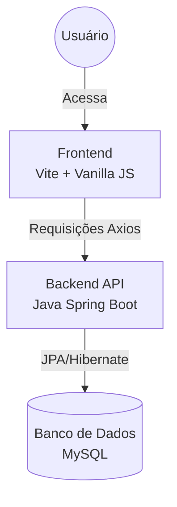

# **🌟 Gerenciamento Geek (GG)**

Este repositório contém o sistema **Gerenciamento Geek (GG)**, uma solução full-stack desenvolvida por **Vitória Rodrigues Ferreira** como projeto de conclusão de curso. O sistema foi projetado para centralizar e otimizar as operações da loja _Geek Station_, focando em controle de estoque, processamento de vendas e gestão de clientes.

## **🚀 Visão Geral do Projeto**

O **Gerenciamento Geek** é uma aplicação web moderna que permite à gerência ter uma visão panorâmica do desempenho da loja, enquanto oferece aos atendentes e caixas ferramentas ágeis para o dia a dia operacional.

| Detalhe               | Especificação                                 |
| :-------------------- | :-------------------------------------------- |
| **Nome do Sistema**   | Gerenciamento Geek (GG)                       |
| **Versão**            | 1.02                                          |
| **Desenvolvido para** | Loja de Varejo Geek Station                   |
| **Objetivo Central**  | Controle de Estoque, PDV e Gestão de Clientes |

## **🏗️ Especificações Técnicas e Arquitetura**

O projeto utiliza uma arquitetura **Client-Server** baseada em uma API RESTful, garantindo modularidade e facilidade de manutenção.

### **Arquitetura do Sistema**



### **Tecnologias Utilizadas**

- **Backend:** Java 17 com framework **Spring Boot 3.5**.
  - Persistência de dados com **Spring Data JPA**.
  - Segurança e autenticação via **Spring Security** e **JWT (JSON Web Tokens)**.
  - Validação de dados com Bean Validation.
- **Frontend:** HTML5, CSS3 e JavaScript Moderno (ES Modules).
  - Ferramenta de build: **Vite 7**.
  - Comunicação: **Axios** para consumo da API.
  - Interface: Design responsivo com CSS puro e animações **GSAP**.
- **Banco de Dados:** **MySQL 8.0** para armazenamento persistente.
- **Infraestrutura:** **Docker** e **Docker Compose** para orquestração de serviços.

## **📂 Estrutura do Projeto (Monorepo)**

O código está organizado em um formato de **Monorepo** utilizando **NPM Workspaces**, facilitando o gerenciamento das dependências de ambas as partes da aplicação.

📦 GGeek  
 ├─ .gitignore  
 ├─ docker-compose.yml (Configuração do Banco de Dados)  
 ├─ package.json (Raiz: Scripts globais)  
 └─ packages  
 ├─ frontend (Aplicação Web \- Vite/JS)  
 └─ backend (API REST \- Java Spring Boot)

## **🔒 Perfis de Acesso e Permissões (RBAC)**

O sistema implementa um controle de acesso baseado em cargos (Role-Based Access Control), garantindo que cada usuário acesse apenas o necessário para sua função.

| Perfil        | Permissões Chave        | Responsabilidades                                 |
| :------------ | :---------------------- | :------------------------------------------------ |
| **Admin**     | Acesso irrestrito.      | Gestão total de funcionários, produtos e vendas.  |
| **Gerente**   | Operações e relatórios. | Supervisão diária e consultas gerenciais.         |
| **Atendente** | Gestão de Catálogo.     | Cadastro de produtos e manutenção de estoque.     |
| **Caixa**     | Ponto de Venda (PDV).   | Registro de vendas e cadastro rápido de clientes. |

## **✅ Principais Requisitos Funcionais**

1. **Gestão de Entidades:** Cadastro completo de funcionários, clientes e produtos.
2. **Ponto de Venda (PDV):** Processamento de vendas com baixa automática de estoque.
3. **Segurança:** Autenticação por login/senha com senhas criptografadas (BCrypt).
4. **Integração de Pagamento:** Suporte para Cartão (Crédito/Débito) e Dinheiro no ato da venda.
5. **Consulta e Listagem:** Filtros dinâmicos em tabelas para busca rápida de informações.

# **🛠️ Como Executar o Projeto**

Siga os passos abaixo para rodar o ambiente completo localmente.

### **Pré-requisitos**

- Node.js (v18+)
- Docker e Docker Compose
- Java JDK 17 (para compilação do backend)

### **1\. Preparação do Banco de Dados**

Na raiz do projeto, suba o container do MySQL:

```bash
npm run db:up
```

### **2\. Configuração do Backend**

Entre na pasta do backend e execute a aplicação:

```bash
cd packages/backend
./mvnw spring-boot:run
```

### **3\. Configuração do Frontend**

Em um novo terminal, instale as dependências e inicie o servidor de desenvolvimento do Vite:

```bash
npm install
npm run dev:frontend
```

O frontend estará disponível em http://localhost:5173.

### **Contato**

Desenvolvido por **Vitória Rodrigues Ferreira**. Para dúvidas sobre a implementação técnica ou colaborações, sinta-se à vontade para entrar em contato através deste repositório.
