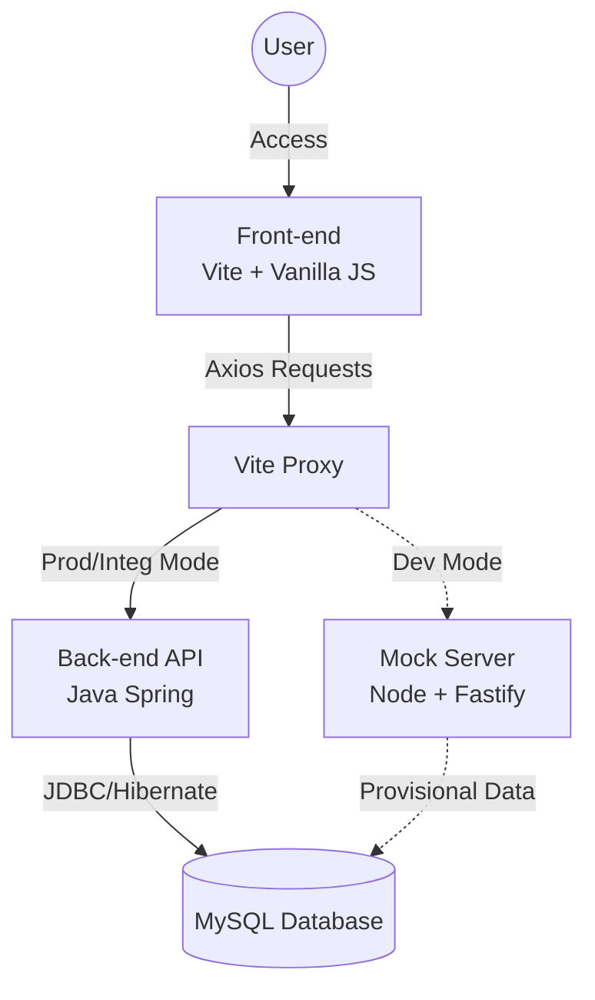

# PROJETO INTEGRADOR II: DOCUMENTAÇÃO TÉCNICA

**Nome do Sistema:** Gerenciamento Geek (GG)  
**Versão:** 1.02  
**Responsável:** Vitória Rodrigues Ferreira

---

## 1. APRESENTAÇÃO

O sistema **Gerenciamento Geek** foi desenvolvido para atender às necessidades operacionais da loja Geek Station. Sua finalidade principal é otimizar o controle de estoque, o processamento de vendas e o gerenciamento de dados de clientes.

A solução é baseada em uma arquitetura web moderna, permitindo que a gerência obtenha uma visão panorâmica do desempenho da loja e dos níveis de estoque, enquanto fornece aos atendentes e caixas interfaces ágeis para o atendimento ao cliente, processamento de vendas, consultas rápidas de produtos e gestão de trocas.

---

## 2. DESCRIÇÃO DO PROJETO E PERFIS DE USUÁRIO

O sistema integra funcionalidades distintas adaptadas a diferentes perfis de acesso. O objetivo central é a gestão eficiente do fluxo de informações através de estruturas robustas de cadastro e permissionamento.

### 2.1. Entidades do Sistema

O sistema gerenciará os seguintes registros fundamentais:
* Funcionários
* Clientes
* Produtos
* Vendas

### 2.2. Perfis de Acesso

* **Admin:** Usuário de nível mais alto, responsável pela manutenção do sistema e gestão de funcionários.
* **Gerente:** Responsável pela operação da loja, relatórios e supervisão, com travas de segurança para exclusão de dados sensíveis (vendas).
* **Atendente:** Focado no fluxo de estoque e cadastro de clientes.
* **Caixa:** Focado na finalização de vendas e cadastro rápido de clientes.

### 2.3. Matriz de Permissões e Acesso

Abaixo está a tabela detalhando o nível de autorização para cada funcionalidade principal.

| Funcionalidade / Recurso | Admin | Gerente | Atendente | Caixa |
| :--- | :---: | :---: | :---: | :---: |
| **Funcionários** (Cadastrar/Editar) | Sim | Sim | Não | Não |
| **Clientes** (Cadastrar/Editar) | Sim | Sim | Sim | Sim |
| **Produtos** (Cadastrar/Editar) | Sim | Sim | Sim | Não |
| **Produtos** (Excluir do Catálogo) | Sim | Sim | Sim | Não |
| **Vendas** (Registrar Nova - PDV) | Sim | Sim | Não | Sim |
| **Vendas** (Consultar Histórico) | Sim | Sim | Sim | Sim |
| **Vendas** (Excluir Registro) | Sim | Não | Não | Não |
| **Relatórios Gerenciais** | Sim | Sim | Não | Não |

---

## 3. REQUISITOS FUNCIONAIS (RF)

Abaixo estão listados os requisitos funcionais do sistema, identificados por códigos únicos.

**RF001 – Cadastro de Clientes**
O sistema deve permitir que os perfis Atendente e Caixa cadastrem clientes via formulário web.
* **Dados obrigatórios:** Nome, CPF, telefone e sexo.

**RF002 – Cadastro de Produtos**
O sistema deve permitir que o perfil Atendente cadastre novos produtos no estoque.
* **Dados obrigatórios:** Nome, preço, código, quantidade em estoque, categoria e descrição.

**RF003 – Cadastro de Vendas**
O sistema deve permitir que o perfil Caixa registre vendas (Ponto de Venda).
* **Dados obrigatórios:** Produto, data da venda, código da venda, preço unitário (no momento da venda), quantidade e cliente vinculado.

**RF004 – Cadastro de Funcionários**
O sistema deve permitir que os perfis Administrador e Gerente cadastrem novos funcionários e definam seus cargos.
* **Dados obrigatórios:** Nome, CPF, CEP, logradouro, número, complemento e cargo.

**RF005 – Consulta de Cliente**
O sistema deve permitir que o Administrador e todos os funcionários consultem os dados cadastrais dos clientes.

**RF006 – Consulta de Produto**
O sistema deve permitir que o Administrador e todos os funcionários consultem os produtos com detalhamento completo de informações (preço, estoque, descrição).

**RF007 – Consulta de Venda**
O sistema deve permitir que o Gerente e os funcionários consultem os detalhes das vendas realizadas anteriormente.

**RF008 – Gerenciamento de Clientes (Listagem)**
O sistema deve apresentar uma listagem (tabela/grid) com as informações dos clientes.
* **Permissões extras:** Usuários Administrador ou Gerente podem editar e/ou excluir registros desta tabela.

**RF009 – Gerenciamento de Produtos (Listagem)**
O sistema deve apresentar uma listagem com as informações dos produtos em estoque.
* **Permissões extras:** Administrador, Gerente e Atendente podem editar e/ou excluir produtos listados.

**RF010 – Gerenciamento de Vendas (Listagem)**
O sistema deve apresentar uma listagem contendo o histórico de vendas.
* **Permissões extras:** Usuários Administrador ou Gerente podem editar informações contidas na tabela. Apenas o Administrador pode excluir.

**RF011 – Manutenção do Catálogo**
O sistema deve permitir especificamente que o perfil **Atendente** adicione, edite e remova produtos do catálogo para manter o estoque atualizado.

**RF012 – Formas de Pagamento**
O sistema deve processar e registrar as seguintes formas de pagamento no ato da venda:
* Cartão de Crédito
* Cartão de Débito
* Dinheiro

---

## 4. REQUISITOS NÃO FUNCIONAIS (RNF)

**RNF001 – Usabilidade**
A interface web deve ser responsiva, intuitiva e amigável, garantindo que usuários sem treinamento técnico avançado possam operar o sistema com eficiência através do navegador.

**RNF002 – Segurança**
* **Autenticação:** O acesso ao sistema requer login e senha. As senhas devem ser armazenadas com criptografia (Hash) no banco de dados.
* **Autorização:** O sistema deve validar no *Backend* se a requisição vinda do *Frontend* condiz com o cargo do usuário logado.
* **Integridade:** Todas as transações financeiras devem ser registradas em logs.

**RNF003 – Confiabilidade**
O sistema deve possuir rotinas de backup regulares do banco de dados para mitigar riscos de perda de dados.

---

## 5. ESPECIFICAÇÕES TÉCNICAS E AMBIENTE DE DESENVOLVIMENTO

O projeto adota uma arquitetura moderna e modular, dividida entre ambiente de produção e ferramentas de desenvolvimento.

### 5.1. Diagrama de Arquitetura



### 5.2. Arquitetura de Produção (Alvo)
* **Modelo:** Cliente-Servidor (API RESTful).
* **Back-end:** Java com JDBC e Hibernate.
* **Banco de Dados:** MySQL.

### 5.3. Arquitetura de Front-end (Cliente)
* **Linguagem:** JavaScript (ES Modules), HTML5 e CSS3.
* **Ferramenta de Build:** **Vite**. Utilizado para empacotamento otimizado, gerenciamento de assets e servidor de desenvolvimento com *Hot Module Replacement* (HMR).
* **Comunicação:** Biblioteca **Axios** para requisições HTTP assíncronas.

### 5.4. Estratégia de Desenvolvimento (Mock Server)
Para permitir o desenvolvimento paralelo do Front-end enquanto o Back-end em Java é construído, utiliza-se um servidor provisório:
* **Tecnologia:** Node.js com Fastify e TypeScript.
* **Função:** Simular as rotas da API Java (Mock), recebendo requisições do Axios, validando regras de negócio básicas e retornando dados JSON fictícios ou persistidos temporariamente.

---

## 6. ESTRUTURA DO PROJETO (MONOREPO)

O código-fonte está organizado no formato de **Monorepo** utilizando **NPM Workspaces**. Isso permite gerenciar tanto o Front-end quanto o Mock Server no mesmo repositório, compartilhando configurações e simplificando a execução de scripts.

**Estrutura de Diretórios:**

```text
📦 GGeek
├─ .gitignore
├─ README.md
├─ docker-compose.yml  (Infraestrutura: Banco de dados e Containers)
├─ package.json        (Raiz: Orquestra scripts e workspaces)
└─ packages
    ├─ front           (Aplicação Web - Vite/JS)
    │   ├─ vite.config.js
    │   └─ src/
    │
    ├─ mockserver      (API de Teste - Fastify/Node)
    │   ├─ src/
    │   └─ index.ts
    │
    └─ backend         (API de Produção - Java)
        ├─ src/
        └─ pom.xml
```

---

# 🛠️ COMO RODAR O PROJETO

Para executar este projeto localmente, siga as etapas abaixo.

## Pré-requisitos

- Node.js (v18+)
- Docker & Docker Compose
- Java JDK (versão 17+ para o Backend final)

## Instalação

Na raiz do projeto, instale todas as dependências do monorepo:

```bash
npm install
```

## Execução

Subir o Banco de Dados:
```bash
npm run db:up
```

Rodar o Front e o Mock (Simultaneamente):
```bash
npm run dev:mock
```